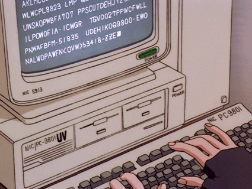

<div align="center">
  
# *Hi, I'm Nursena!* 🪐

<p>
  <strong>Translator & Interpreter 🪩 | AI Writing Consultant 🌌  | Data Linguist to be 🤍 </strong>
</p>  




<br>
  
## **About _me_**

  
🎓 BA in _Translation & Interpreting_ from the Başkent University, Türkiye | **GPA:** 3.85/4.00

⚡️Currently pursuing an MA in _Language Acquisition in Multilingual Settings (LAMS)_ at the University of the Basque Country (Universidad del País Vasco), Spain

<div align="center">
  
<br>

## Languages

```Turkish (Native] | English (C2) | Spanish (C1) | Korean (B1) | Italian (B1)```

<br>

<div align="center">

## ⛓️‍💥 Tech Skills
<br>


<br>

## 💻 CAT & AVT Tools  
<br>


<br>

## 📎 What I do

<div align="left">

• Multilingual Emotional Valence Analysis

• Translation & Localization (Medicine, Psychology, Health Tourism, AVT, Legal, BTC ♾️)

• AI linguistics & writing assistant projects

• Newbie Pythonista + SQL enthusiast

<div align="center">

<br>
  
## 📍 Current Projects & Goals

<div align="left">
  
📊 Mini SQL and Python projects
  
🔠 Contributing to open-source linguistics / AI / translation tools

<br>

<div align="center">

## Contact me

_Let’s collab or vibe!_


